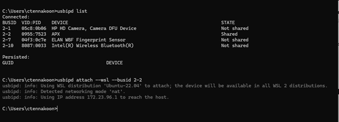
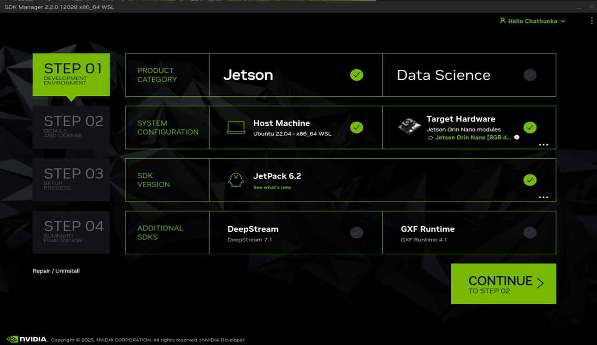
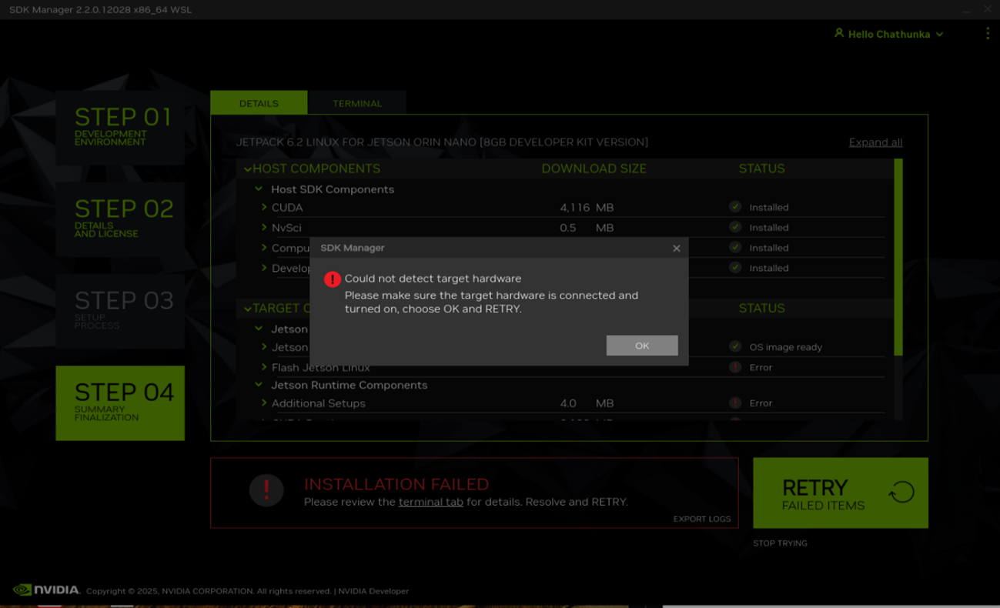

# Jetson Orin Mass Production Procedures

## Method Comparison Table

| Method                             | Ubuntu PC | Windows PC (WSL2) | Windows | Jetson Orin Nano + (Windows/Ubuntu Host PC) |
|------------------------------------|-----------|--------------------|---------|----------------------------------------------|
| SDK Manager (GUI)                 | ✅        | 🔼                | ❌      | ~                                            |
| SDK Manager (CLI)                 | ✅        | 🔼                | ❌      | ~                                            |
| Direct Installation (SD card)     | ~         | ~                 | ~       | ✅                                           |

### Legend
- ✅ = Supported 
- ❌ = Not Supported 
- 🔼 = Partially Supported 
- ~  = Not Applicable

---

## Method 1: Using SDK Manager GUI  

- **Windows Host PC (WSL2)**: 🔼 *Partially supported*  
  Frequent disconnections during flashing. Not recommended but documented for reference.  

  - [👉 NVIDIA SDK Manager for WSL](https://developer.nvidia.com/sdk-manager)  

  **Examples:**
  - Attaching USB to WSL from Windows
    
  

  - Jetson Orin Nano detection in WSL
    
  

  - USB detachment error during JetPack 6.2 flashing
    
   

- **Ubuntu Host PC**: ✅ *Recommended*  
  Stable and fully supported.  

  - [👉 Install Jetson Software with SDK Manager](https://developer.nvidia.com/embedded/jetpack)

---

## Method 2: Using SDK Manager CLI  

- **Windows Host PC (WSL2)**: 🔼 *Partially supported*  
  Similar USB disconnection issues as GUI method.  

- **Ubuntu Host PC**: ✅ *Recommended*  
  Stable and reliable for development and production use.  

### Requirements

1. **Disable Automount of External Storage**  
   Temporarily disable during flashing  
   ```
   $ systemctl stop udisks2.service
   ```

2. **Install Dependencies**  
   ```
   $ sudo tools/l4t_flash_prerequisites.sh
   ```

3. **Start NFS Server on Host**  
   ```
   $ sudo service nfs-kernel-server start
   ```

---

### Step 1: Prepare the Master Device  
Update UEFI firmware, configure system, and install all necessary software.  

---

### Step 2: Create a Backup of the System Image  
**ステップ2：システムイメージのバックアップ作成**

1. Connect only one Jetson device in recovery mode.  
   [Recovery Instructions](https://forums.developer.nvidia.com/t/how-to-get-into-recovery-mode/250525)

2. Run backup script:
   ```bash
   $ sudo ./tools/backup_restore/l4t_backup_restore.sh [ -e <devname> ] -b <board-name>
   ```
   - `<board-name>` = Same as in `flash.sh`
   - `<devname>` (optional): e.g., `-e mmcblk0:nvme0n1`

3. Backup will be saved to:  
   ```
   Linux_for_Tegra/tools/backup_restore/images
   ```

---

### Step 3: Flash the Image to Other Devices  

#### Mass Flash Using a Backup Image  

1. Connect Jetson device in recovery mode  
   [Recovery Instructions](https://forums.developer.nvidia.com/t/how-to-get-into-recovery-mode/250525)

2. Create a massflash image:
   ```bash
   $ sudo ./tools/backup_restore/l4t_backup_restore.sh -b -c <board-name>
   ```

   > Massflash does **not** support multiple external devices like `-e nvme0n1:sda`.

3. On success, initrd image saved to:
   ```
   Linux_for_Tegra/tools/kernel_flash/images
   ```

4. Reboot into recovery mode and generate massflash package:
   ```bash
   $ sudo ./tools/kernel_flash/l4t_initrd_flash.sh --use-backup-image --no-flash --network usb0 --massflash <x> <board-name> internal
   ```

5. Flash new devices:
   ```bash
   $ sudo ./tools/kernel_flash/l4t_initrd_flash.sh --flash-only --massflash <x> --network usb0
   ```

   Or use:
   ```
   mfi_<target-board>.tar.gz
   ```
   - Refer to Initrd flash README for further details.

---

## Method 3: Direct Installation via SD Card  

- Flash the Jetson image directly to an SD card.  
  Host PC is only needed to prepare SD card using JetPack 6.2.

- ✅ *Recommended* for mass production with pre-flashed SD cards.

- [👉 Jetson Orin Nano Initial Setup (Jetson AI Lab)](https://developer.nvidia.com/embedded/jetson-orin-nano-devkit)

